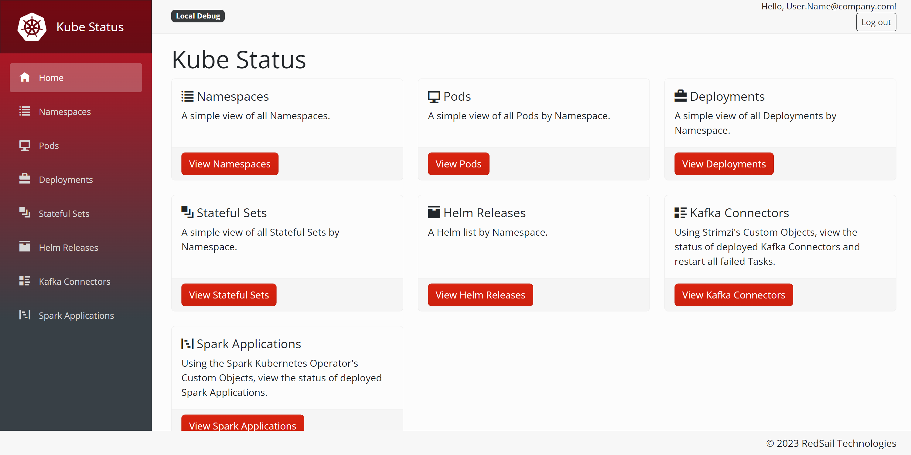
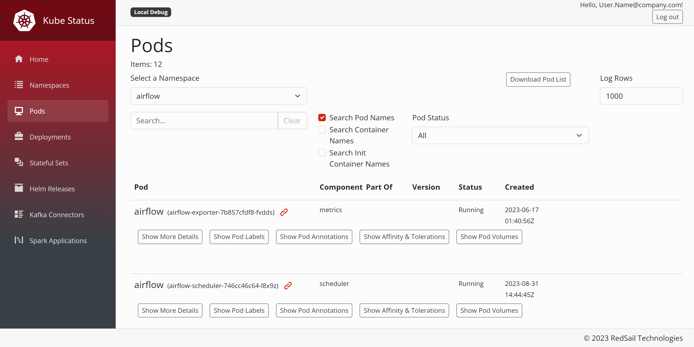
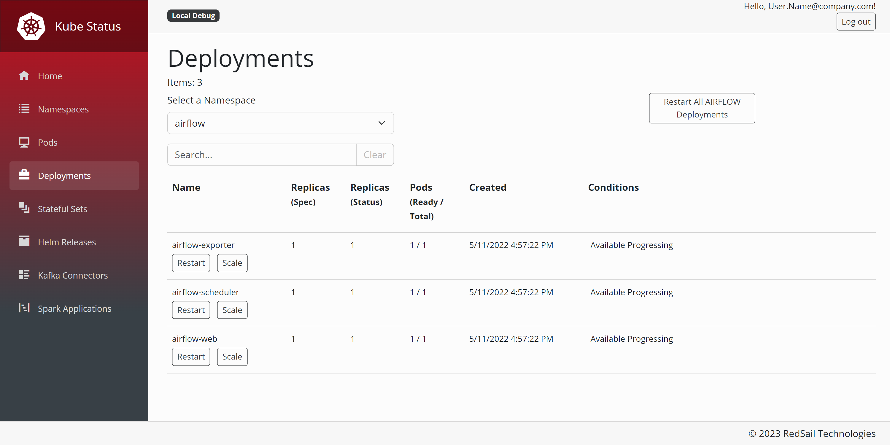
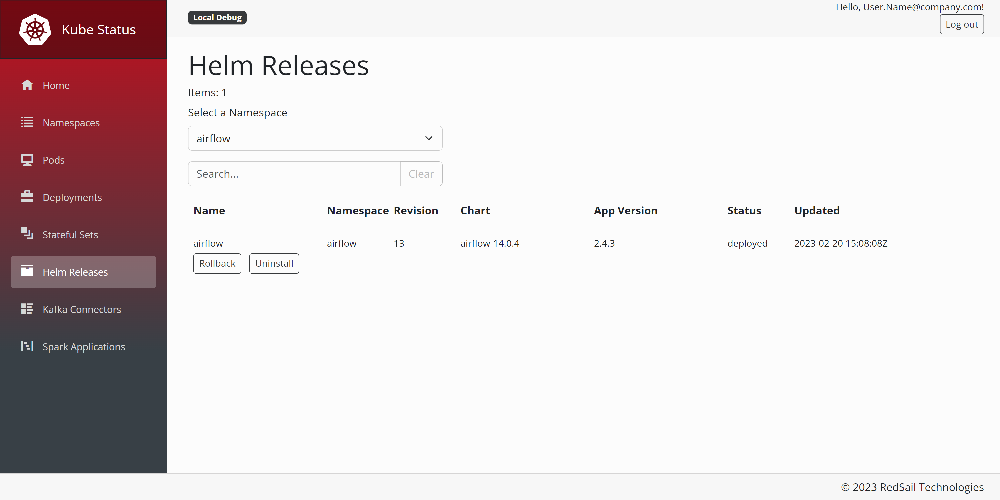

[![Contributors][contributors-shield]][contributors-url]
[![Forks][forks-shield]][forks-url]
[![Stargazers][stars-shield]][stars-url]
[![Issues][issues-shield]][issues-url]
[![MIT License][license-shield]][license-url]

# Kube Status

## Intro

This project began as a simple dashboard that allowed our organization to view deployed Pod versions by Namespace.

It's safe to say that Kube Status has grown into much more than a view-only dashboard with features like Deployment Restart, Helm Rollback & Uninstall, and even Restart Failed Strimzi Kafka Connectors.

It is also safe to say that this project is very opinionated. The tool is meant to service our organization, but we're happy to share if this helps or inspires others in their Kubernetes adventure. Where possible, we try to provide Environment Variable overrides that might provide some flexibility.

## Screenshots

## Things To Know

### Security

Most importantly, as of today, **Kube Status does _NOT_ have any built in authentication**. If you deploy this app and expose an ingress with no proxy, it could be very dangerous to your environment. Depending on future use and needs, there are plans for native auth roles and access limitation, but as of now, there is no timeline for this [enhancement](https://github.com/RedSailTechnologies/kube-status/issues/4).

> If it's wide open, how do I safely use Kube Status?

Great question! We use [Istio](https://istio.io/) as our service mesh and ingress in Kubernetes. Additionally, we use [Oauth2Proxy](https://oauth2-proxy.github.io/oauth2-proxy/) in conjunction with Istio to secure access into Kube Status. There are a lot of great blog posts and community posts for how to deploy either or both of these tools if you search the web.

To simplify deployment, the provided Helm chart can create the necessary Istio assets if enabled.

### UI And API All In One

Kube Status began as an API driven application for simple post and response. We added a UI layer after beginning the project. Anything that can be accomplished in the UI is also exposed via the API.

### Kafka

We use (and love) the [Strimzi Kubernetes Operator](https://strimzi.io/) to simplify our Kafka on Kubernetes deployments. There is a dedicated page that shows the overview of KafkaConnector objects.

One of the best features Strimzi offers is a simple to create Kafka Connector Cluster. However, if you've ever used Kafaka Connectors, you know they are not without fault. Specifically, at a core level, Apache decided not to allow Kafaka Connectors to automatically restart after a failure. This is a real bummer when the Connector fails because of a network blip. The second feature added to Kube Status was the ability to restart Strimzi managed Kafka Connectors using an Annotation on the KafkaConnector object. I'll mention more about this in the Usage section below.

### Spark Operator

We use the [Spark Operator](https://github.com/GoogleCloudPlatform/spark-on-k8s-operator) to run hundreds of Spark Jobs in Kubernetes. There is a dedicated page that shows the status of SparkApplication objects.

### Helm

We use [Helm](https://helm.sh/) as our primary deployment tool for all applications.

The helm chart provided in this repository provides RBAC rights to meet our needs as an organization. Depending on the types of objects your Helm charts create, it's possible that the RBAC Rules will need to be adjusted for your needs.

Additionally, since Helm is not native in the Kubernetes API, the Kube Status container image installs the Helm CLI tool and uses [CliWrap](https://github.com/Tyrrrz/CliWrap) to perform Helm actions. When debugging Kube Status locally, ensure that you have Helm in your system path to test these features.

If you do not use Helm, there is an Environment Variable that will hide Helm options from the UI.

## Technology

Kube Status is written in C# using Blazor Server as the UI.

For simplicity, Blazor Server was chosen so that the Kubernetes API Server does not have to be exposed publicly. We could write two discreet apps - UI and API, but the overall complexity of configuration, authentication, and deployment was just too much to consider for our current needs.

## Installation

The fastest way to get started is simply:

1. Clone this git repository
2. Use the Helm command: `helm upgrade --install kube-status helm/`

If you'd like to enable/disable features, adjust `helm/values.yaml` and rerun the provided Helm command.

## Usage

### Environment Variables

#### DotNet Environment Variables

DotNet has some well known and documented Environment Variables. Here are three that we use:

- COMPlus_EnableDiagnostics: "0"
  - Set to `0` because we run the container as an unprivileged user.
- ASPNETCORE_ENVIRONMENT: Production
  - Set to `Production` to ensure that any dev configs are not used.
- ASPNETCORE_URLS: http://+:8080;http://+:58080
  - This ensures that Kestrel exposes the application at the referenced ports. We use port 8080 (`http`) for primary traffic and port 58080 (`metrics`) for Prometheus scrapping.

#### Kube Status Environment Variables

The following Environment Variables are specific to Kube Status and can be set however needed via Helm:

- ENABLE_SWAGGER: "true"
  - Should the Swagger page be rendered when the Pod is deployed?
- UI_HEADER: "My Kube Cluster"
  - If you run multiple Kubernetes Clusters (especially if they're Istio meshed), this is a nice way to see which cluster one you're hitting in the UI.
- KUBE_CA_FILE: "/run/secrets/kubernetes.io/serviceaccount/ca.crt"
  - The typical mount piont for the Service Account's CA cert.
- KUBE_TOKEN_FILE: "/run/secrets/kubernetes.io/serviceaccount/token"
  - The typical mount point for the Service Account's Token.
- UI_SHOW_HELM: "true"
  - Should Helm elements be exposed in the UI?
- POD_METRIC_PORT_PAGE: "metrics|metrics"
  - A pipe separated string that determines if the Metrics Download will be exposed to the UI. `{port_name}|{url_route}`
- STRIMZI\_\_CONNECT_CLUSTER_SERVICE_HOST: http://cluster-connect-api.strimzi.svc.cluster.local:8083/
  - The URL to the Strimzi Connect Cluster. This is used to retrieve real time information about the Connect Cluster (instead of Operator posted feedback on the CR) in the UI.

### Cron Jobs

Currently, the provided Helm chart does not include any sample Kubernetes Cron Jobs as the actual execution of our Cron Jobs happens inside some corporate (closed source) containers. That said, let me share which API endpoints we target with our Cron Jobs to hopefully spark some ideas for you.

#### Restart Failed Connectors

Targeting `/api/KafkaConnectors/RestartFailed` with a curl command from another Pod will search for all Connectors in a Failed state and add the necessary Strimzi Annotation for the Strimzi Operator to restart it. We have a Cron Job that runs every 5 minutes to ensure our Outbox Pattern doesn't fall behind.

#### Failed Spark Applications Cleanup

Targeting `/api/SparkApplications/168` with a curl command from another Pod will delete any Failed Spark CR that is older than 168 hours (7 days).  We chose 7 days, however the URL accepts any hour amount - pick what works best for you. If you use Airflow and Spark, you likely know how past Failed CRs can clog up the system. We run this command every 30 minutes.

#### Restart All Deployments In A Namespace

Okay, I know, I know... This is awful to schedule. It is. I'm just saying that there are some apps which do not automatically restart their Kafka Consumers after Consumer Timeouts and they might need a nightly kick.

## Contributing

1. Fork it!
2. Create your feature branch: `git checkout -b my-new-feature`
3. Commit your changes: `git commit -am 'Add some feature'`
4. Push to the branch: `git push origin my-new-feature`
5. Submit a pull request :D

## License

Distributed under the MIT License. See `LICENSE` for more information.
